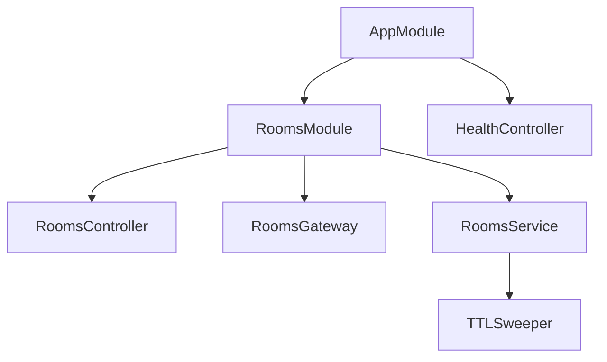
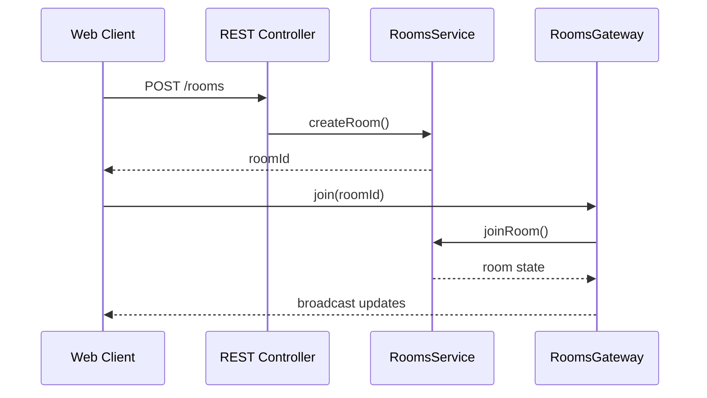

# API Architecture

The API project is a NestJS application that manages planning poker rooms and synchronizes state across clients.

## Module Structure

- **RoomsController** – REST endpoints for creating rooms and retrieving state.
- **RoomsGateway** – Socket.IO gateway that broadcasts events.
- **RoomsService** – central room logic and coordination.
- **TTL Sweeper** – background service removing expired rooms.
- **HealthController** – simple health check endpoint.

## Request Flow

Shared models are imported from `@scrum-poker/shared-types` to keep the contracts consistent.
