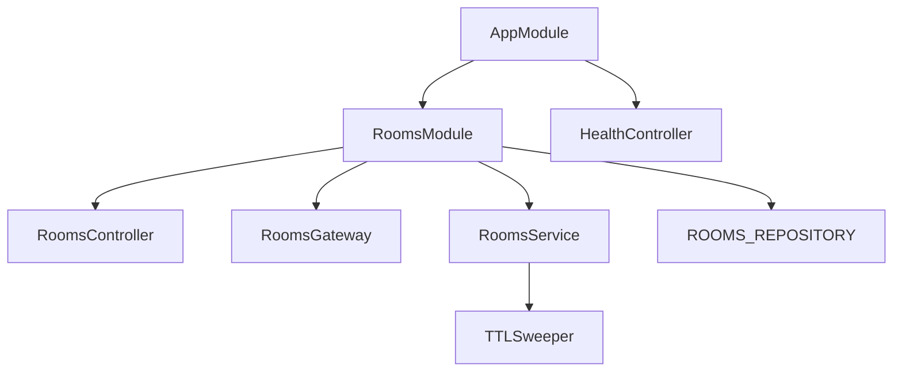
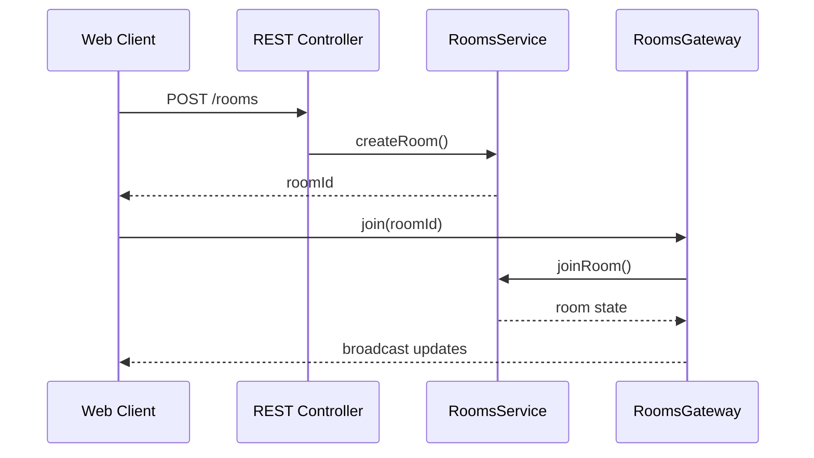

# API Architecture

The API project is a NestJS application that manages planning poker rooms and synchronizes state across clients.

## Module Structure

- **RoomsController** – REST endpoints for creating rooms and retrieving state.
- **RoomsGateway** – Socket.IO gateway that broadcasts events.
- **RoomsService** – central room logic and coordination. Uses a `RoomsRepository` abstraction to persist state.
- **ROOMS_REPOSITORY** – DI token that binds to either an in-memory or Redis-backed repository based on env.
- **TTL Sweeper** – background service removing expired rooms.
- **HealthController** – simple health check endpoint.

## Request Flow

Shared models are imported from `@scrum-poker/shared-types` to keep the contracts consistent.

## Persistence & Scale

- The `RoomsService` is backed by a `RoomsRepository`:
  - In development (default), `InMemoryRoomsRepository` stores rooms in-process.
  - In production, set `ROOMS_BACKEND=redis` and `REDIS_URL=redis://host:6379` to activate `RedisRoomsRepository`.
- Room TTLs (24h) are enforced by Redis when the Redis backend is active; the `TtlSweeperService` becomes a no-op.
- When `ROOMS_BACKEND=redis`, the Socket.IO server is configured with the official Redis adapter so broadcasts fan out across instances.
