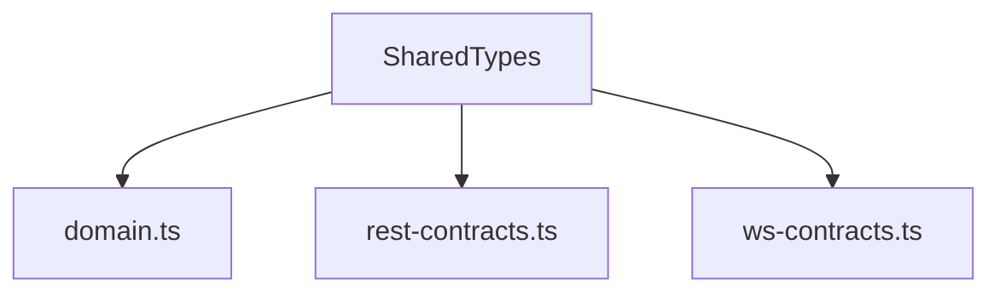
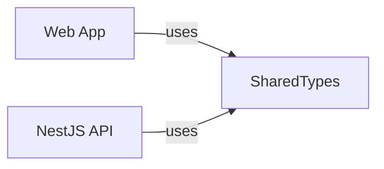

# Shared Types Library

This library hosts domain models and contract definitions shared by the web and API projects.

## Structure

- **domain.ts** – core entities such as `Room` and `Player`.
- **rest-contracts.ts** – shapes of HTTP requests and responses.
- **ws-contracts.ts** – WebSocket message formats.

## Data Sharing

Using a shared package ensures server and client remain in sync.
