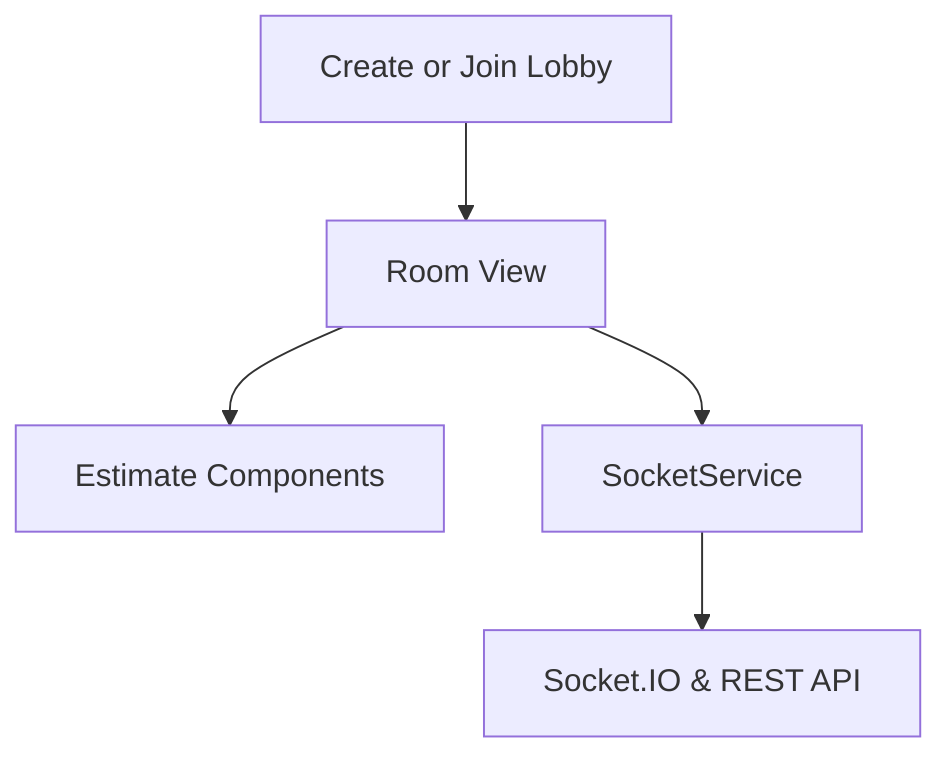
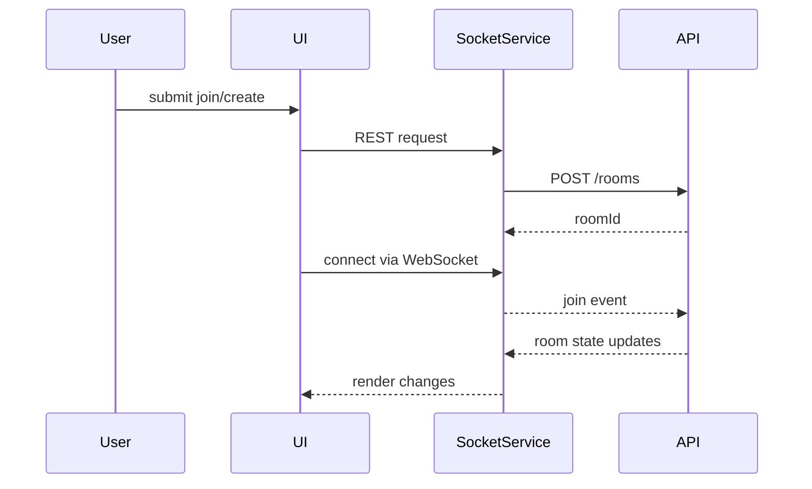

# Web App Architecture

The web project is an Angular front end that provides the user interface for planning poker sessions.

## Component Flow

- **Lobby** – form for creating or joining a room.
- **Room** – displays participants and their estimates.
- **Estimate Components** – controls for submitting values.
- **SocketService** – wraps Socket.IO client and HTTP calls.

## Data Flow

Type definitions come from the shared-types library to maintain parity with the server.
