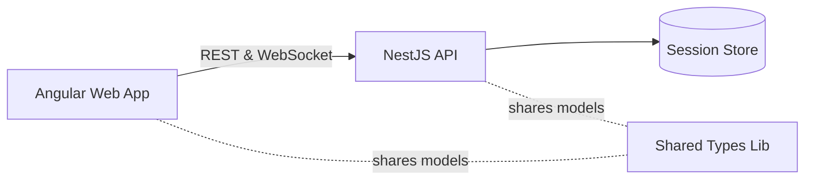

# System Architecture

This document outlines the core pieces of the Planning Poker workspace and how they interact.

- **Web App** – Angular client for hosting and joining estimation sessions.
- **API** – NestJS server exposing REST endpoints and Socket.IO gateway.
- **Session Store** – in-memory storage that tracks active rooms and participants.
- **Shared Types** – library of domain models and contracts consumed by both web and API projects.

For more information see:

- [API architecture](../apps/api/docs/architecture.md)
- [Web architecture](../apps/web/docs/architecture.md)
- [Shared types details](../apps/shared-types/docs/architecture.md)
